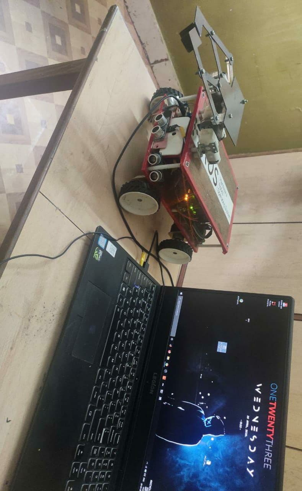
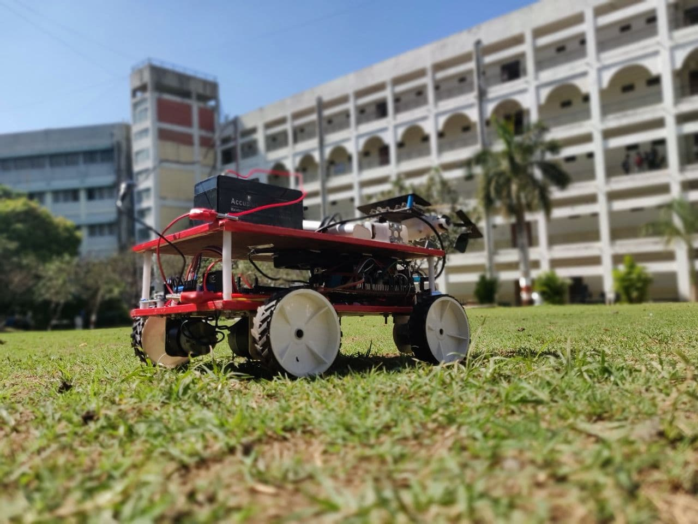
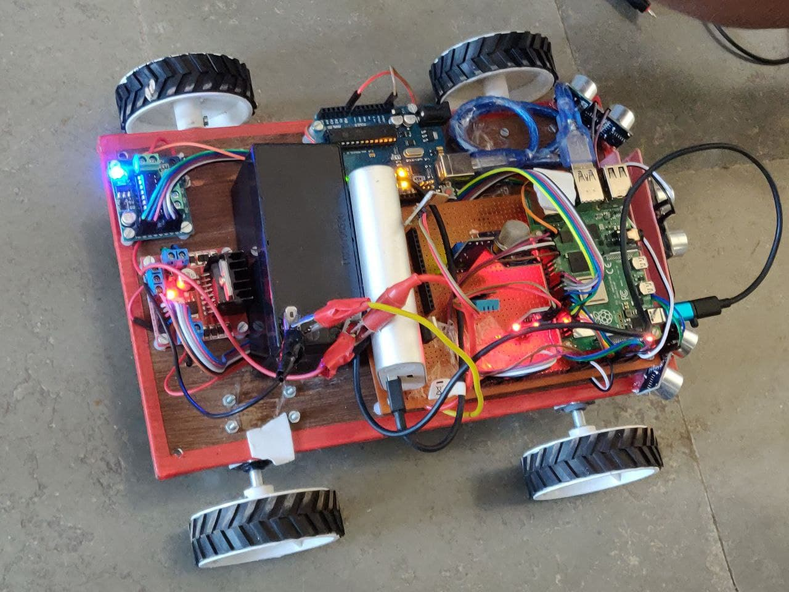
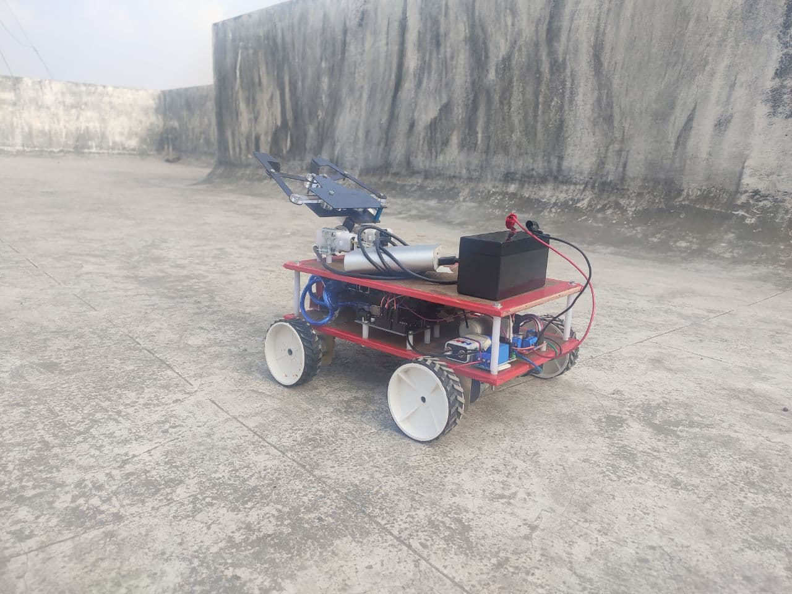

  <h1 align="center">Botbeats</h1>

  

    Smart Decision System For Digital Agriculture
     
     
    <a href="https://github.com/othneildrew/Best-README-Template">View Demo</a>
    ·
    <a href="https://github.com/othneildrew/Best-README-Template/issues">Report Bug</a>
    ·
    <a href="https://github.com/othneildrew/Best-README-Template/issues">Request Feature</a>
  

<!-- TABLE OF CONTENTS -->

  
Table of Contents

  <ol>
    <li>
      <a href="#about-the-project">About The Project</a>
      <ul>
        <li><a href="#built-with">Built With</a></li>
      </ul>
    </li>
    <li><a href="#contact">Contact</a></li>
  </ol>

<!-- ABOUT THE PROJECT -->
## About The Project

Modern Agriculture and not only huge but even the small scale farms these days are burden to look upon considering its maintenance and daily tasks such as watering plants, sowing seeds, curing plant diseases etc. The smart decision system is an attempt to reduce this burden to some extent. The basic notion of this system is to shift dependence on large scale agriculture by giving farmers ability to cultivate their own plants with no or very less labor. The smart decision system is controlled by an Arduino and internet connected to Raspberry Pi 4. The hardware is designed to be simple, scalable and easily produced. It is specialized to care and feed water and few nutrients to each plant if needed. Other features include storing and manipulating data tables using a platform online thereby getting information like moisture content at present, type of plant disease if any, suitable temperature etc. which means with this system a person with almost negligible effort can garden his farm by just few taps on the screen of a phone or a computer to facilitate data driven design and real time control and logging in to application

**More details cannot be shared as patent is pending**

### Built With

Hardware
1)	Arduino with cable
2)	Raspberry Pi-4
3)	Motor Drivers (LM2987, LM293D)
4)	Camera Module
5)	Soil Moisture sensor
6)	Temperature Sensor (DHT11)
7)	3 Ultrasonic sensors
8)	Gas sensor (MQ2)
9)	Wooden chassis with tyres
10)	DC Motor (160 rpm)
11)	Jumper Cables
12)	12V Rechargeable Battery and 5V power bank
13)	Water Tank (A5 size)
14)	Submersible Motor

Software

1)	Python
2)	Javascript
3)	Opencv
4)	Machine learning

<!-- CONTACT -->
## Contact

Ameya Upalanchi - ameya.upalanchi18@vit.edu
